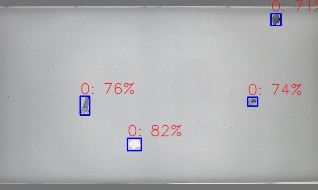
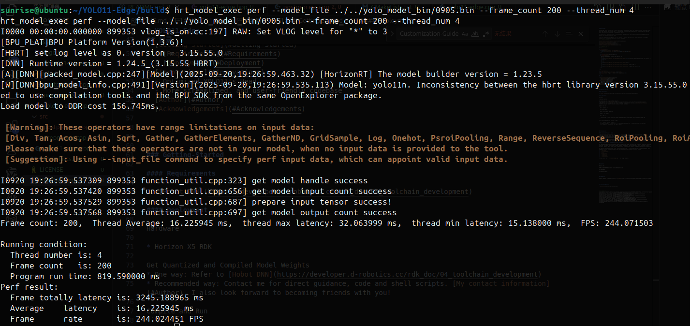

# YOLO11-Edge

YOLO11-Edge is an engineering project specifically designed to deploy the computer vision algorithm YOLO11 onto edge devices (Horizon X5 RDK). To ensure high efficiency and compatibility with the Horizon X5 RDK Infer API, all inference code is implemented in C++. 

Furthermore, to maximize YOLO11's performance on edge devices, the project optimizes the dequantization process in the model's output head. 

Finally, the project integrates with the Horizon X series' edge inference code framework, providing a cleaner, more streamlined, and user-friendly codebase.
<!-- PROJECT SHIELDS -->

[![Contributors][contributors-shield]][contributors-url]
[![Forks][forks-shield]][forks-url]
[![Stargazers][stars-shield]][stars-url]
[![Issues][issues-shield]][issues-url]
[![MIT License][license-shield]][license-url]

<!-- PROJECT LOGO -->
<br />

<p align="center">
  <a href="https://github.com/786739982//">
    
  </a>

  <h3 align="center">YOLO11-Edge</h3>
  <p align="center">
    Deploy the Embodied AI onto Edge Devices ！
    <br />
    <a href="https://github.com/786739982/YOLO11-Edge"><strong>Explore the documentation of this project »</strong></a>
    <br />
    <br />
    <a href="https://github.com/786739982/YOLO11-Edge">Demo</a>
    ·
    <a href="https://github.com/786739982/YOLO11-Edge/issues">Report Bug</a>
    ·
    <a href="https://github.com/786739982/YOLO11-Edge/issues">Propose New Feature</a>
  </p>

</p>

<p align="center">

<h3 align="center">Figure : Infer On The Edge Device</h3>
</p>

## 目录

- [Getting-Started](#Getting-Started)
  - [Requirements](#Requirements)
  - [Deployment](#Deployment)
- [Innovations](#Innovations)
  - Optimized YOLO11's Head
  - More streamlined, and user-friendly codebase
- [Author](#Author)
- [Acknowledgements](#Acknowledgements)


### Getting-Started

#### Requirements

1. [Hobot DNN](https://developer.d-robotics.cc/rdk_doc/04_toolchain_development)

#### Deployment

Hardware

* Horizon X5 RDK

Get Quantized and Compiled Model Weights
* One way: Refer to [Hobot DNN](https://developer.d-robotics.cc/rdk_doc/04_toolchain_development)
* Recommended way: Contact me for direct guidance, code and shell scripts. [My contact information](#Author). I also look forward to becoming friends with you!

Compile and Run
```
  # --- Compile ---
  
  cd YOLO11-Edge/

  mkdir -p build && cd build
  
  cmake .. && make -j

  # --- Run ---

  ./yolo11-edge --model_path /your_model_path/model.bin --image_path /your_image_path/image.jpg
```

Test Quantized Model on Horizon X5 RDK
```
  # --- Exec on Horizon X5 RDK ---
  hrt_model_exec perf --model_file ../../yolo_model_bin/0905.bin --frame_count 200 --thread_num 4
  # The output is as shown in the figure below. Frame rate is over 200 FPS.
```
<p align="center">

<h4 align="center">Figure : Test Model On The Edge Device (244 FPS)</h4>
</p>


### Innovations

#### Optimized YOLO11's Head

* First, splitting one output head into six, corresponding to the outputs of three stride levels.
* Second, filtering valid bbox outputs using a confidence score metric.
* Third, perform dequantization on the valid bbox outputs.
* Finally, perform the normal YOLO11 post-processing (including decoding, NMS, and possibly visualization).

The benefit of the above operations is that, compared to the original version, this approach significantly reduces the computational load of bbox dequantization, thereby improving computational efficiency.

#### More Streamlined, and User-Friendly Codebase

To implement model inference within the Horizon X series' edge inference code framework, numerous steps are required, including applying for a model handle, task handle, allocating memory space, checking validity, and more. Many of these steps differ significantly from those in commonly used PyTorch inference frameworks.

To address the aforementioned issue, this project develope a streamlined and user-friendly codebase. This codebase involves only a few steps, and the framework follows common workflows, such as :
* ```load_model```
* ```allocCachedMem```
* ```infer```
* ```postprocess```
* ```release_task```
* ```release_mem```
* ```release_model```

You can refer to ```src/yolo11-edge.cpp``` for usage details.


### Author

Hongrui Zhu 

E-Mail：786739982@qq.com or hongrui0226@gmail.com

qq:786739982

vx：Hong_Rui_0226


  
### 版权说明

该项目签署了MIT 授权许可，详情请参阅 [LICENSE](https://github.com/786739982/YOLO11-Edge/blob/master/LICENSE)


### Acknowledgements

- [DISCOVERSE](https://airbots.online/)


<!-- links -->
[contributors-shield]: https://img.shields.io/github/contributors/786739982/YOLO11-Edge.svg?style=flat-square
[contributors-url]: https://github.com/786739982/YOLO11-Edge/graphs/contributors
[forks-shield]: https://img.shields.io/github/forks/786739982/YOLO11-Edge.svg?style=flat-square
[forks-url]: https://github.com/786739982/YOLO11-Edge/network/members
[stars-shield]: https://img.shields.io/github/stars/786739982/YOLO11-Edge.svg?style=flat-square
[stars-url]: https://github.com/786739982/YOLO11-Edge/stargazers
[issues-shield]: https://img.shields.io/github/issues/786739982/YOLO11-Edge.svg?style=flat-square
[issues-url]: https://img.shields.io/github/issues/786739982/YOLO11-Edge.svg
[license-shield]: https://img.shields.io/github/license/786739982/YOLO11-Edge.svg?style=flat-square
[license-url]: https://github.com/786739982/YOLO11-Edge/blob/master/LICENSE.txt
[linkedin-shield]: https://img.shields.io/badge/-LinkedIn-black.svg?style=flat-square&logo=linkedin&colorB=555


